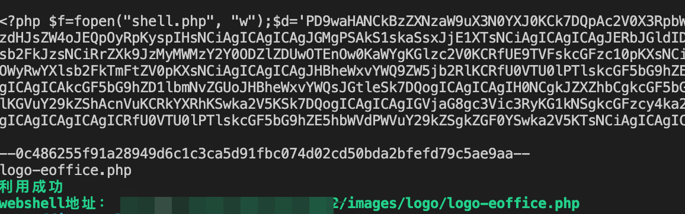
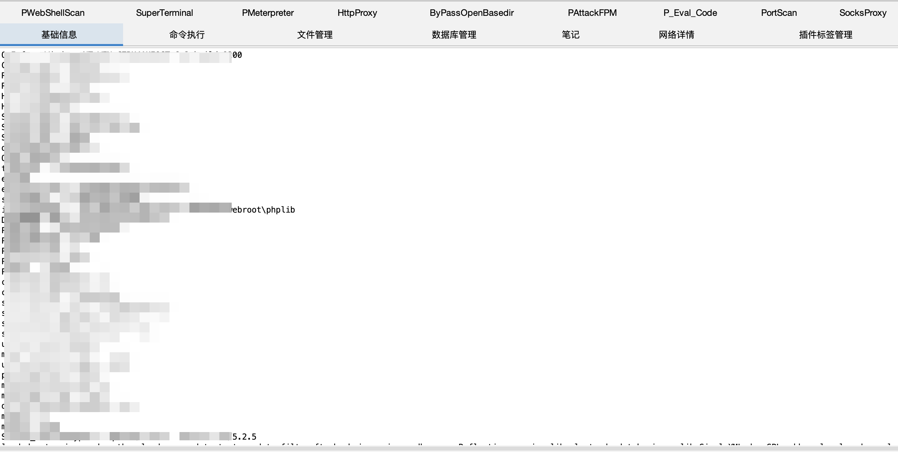

# 泛微E-OFFICE v9.0 CVND-2021-49104漏洞复现

> 如果成功上传后会返回logo-eoffice.php，在本脚本中使用是重写webshell的，所以会请求一次logo-eoffice.php，再验证真的webshell是否写入成功，成功则输出shell地址。

```bash
  go run main.go -h
  -file string
        需要上传输的文件
  -url string
        目标地址
```

> 测试目标在上传冰蝎shell后无法使用，但godzilla的马是可以的。




### 声明 
> 请在受权的测试目标上使用本工具，如果非法使用，责任由使用人自负，与本人无关。
